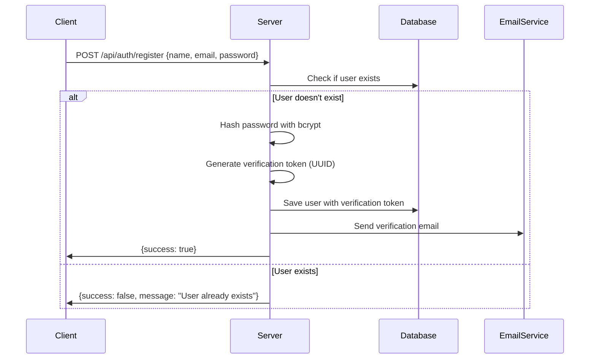
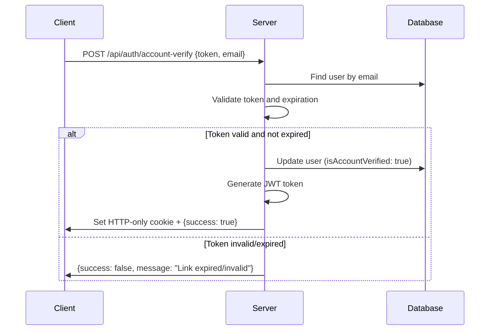
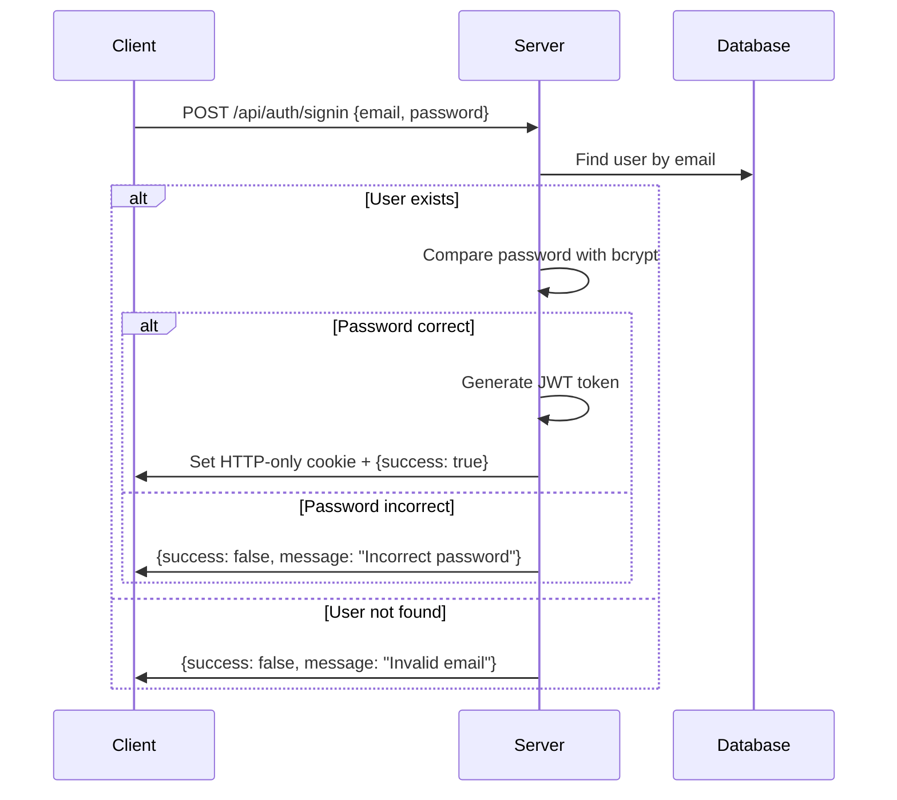
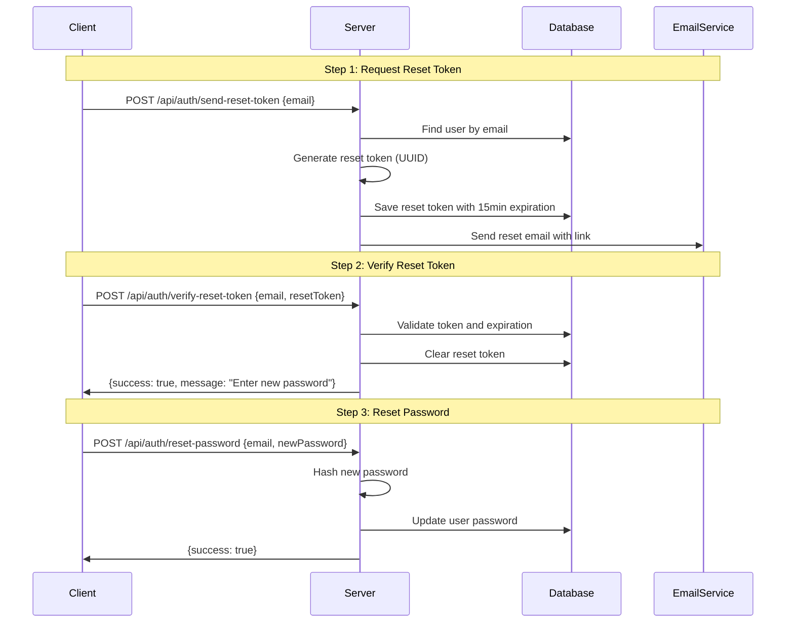
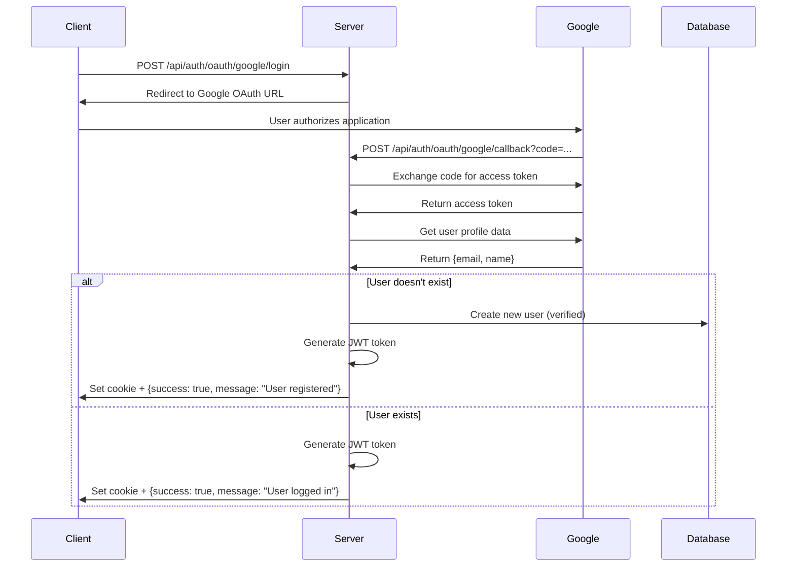

# IT Project Demo - Authentication Backend

## Overview

This is a Node.js backend application that provides comprehensive user authentication services including user registration, email verification, login/logout, password reset, and Google OAuth integration. The application is built using modern JavaScript (ES6 modules) and follows RESTful API conventions.

## Architecture

### Technology Stack

- **Runtime**: Node.js with ES6 modules
- **Framework**: Express.js 5.1.0
- **Database**: MongoDB with Mongoose ODM
- **Authentication**: JWT (JSON Web Tokens)
- **Password Hashing**: bcryptjs
- **Email Service**: Nodemailer
- **OAuth**: Google OAuth 2.0
- **Development**: Nodemon for auto-restart

### Project Structure

```
IT_Project_demo/
├── config/
│   ├── connectDB.js      # MongoDB connection configuration
│   └── mailer.js         # Email transporter configuration
├── controllers/
│   ├── Auth.js           # Main authentication logic
│   └── oAuthController.js # Google OAuth implementation
├── middlewares/
│   └── userAuth.js       # JWT authentication middleware
├── models/
│   └── UserModel.js      # User data model (Mongoose schema)
├── routes/
│   └── authRoutes.js     # API route definitions
├── server.js             # Main application entry point
├── package.json          # Project dependencies and scripts
└── .gitignore           # Git ignore rules
```

## Data Model

### User Schema

The application uses a MongoDB collection called 'user' with the following structure:

```javascript
{
  email: String (unique, required),           // User's email address
  name: String (required),                    // User's full name
  password: String (default: ''),             // Hashed password (bcrypt)
  verifyToken: String (default: ''),          // Email verification token
  verifyTokenExpireAt: Number (default: 0),   // Token expiration timestamp
  isAccountVerified: Boolean (default: false), // Account verification status
  resetToken: String (default: ''),           // Password reset token
  resetTokenExpireAt: Number (default: 0)     // Reset token expiration timestamp
}
```

## Authentication Flow

### 1. User Registration Process



**Key Features:**
- Password hashing using bcryptjs with salt rounds of 10
- UUID-based verification tokens with 15-minute expiration
- Automatic email sending with verification link
- Prevention of duplicate accounts

### 2. Email Verification Process



### 3. User Login Process



### 4. Password Reset Process



### 5. Google OAuth Integration



## API Endpoints

### Authentication Routes (`/api/auth`)

| Method | Endpoint | Description | Body Parameters | Response |
|--------|----------|-------------|-----------------|----------|
| POST | `/register` | Register new user | `{name, email, password}` | `{success: boolean}` |
| POST | `/account-verify` | Verify email account | `{token, email}` | `{success: boolean, message}` |
| POST | `/signin` | User login | `{email, password}` | `{success: boolean}` |
| POST | `/logout` | User logout | None | `{success: boolean, message}` |
| POST | `/is-auth` | Check authentication | None (requires JWT) | `{success: boolean}` |
| POST | `/send-reset-token` | Request password reset | `{email}` | `{success: boolean, message}` |
| POST | `/verify-reset-token` | Verify reset token | `{email, resetToken}` | `{success: boolean, message}` |
| POST | `/reset-password` | Reset password | `{email, newPassword}` | `{success: boolean, message}` |
| POST | `/oauth/google/login` | Initiate Google OAuth | None | Redirect to Google |
| POST | `/oauth/google/callback` | Handle OAuth callback | Query: `{code}` | `{success: boolean, message}` |

## Security Features

### 1. JWT Authentication
- **Token Generation**: Uses RS256 algorithm with configurable secret
- **Storage**: HTTP-only cookies prevent XSS attacks
- **Expiration**: 7-day token lifetime
- **Cookie Security**: 
  - `httpOnly: true` - Prevents JavaScript access
  - `secure: true` - HTTPS only
  - `sameSite: "None"` - Cross-site requests allowed
  - `maxAge: 7 days` - Automatic expiration

### 2. Password Security
- **Hashing**: bcryptjs with 10 salt rounds
- **Validation**: Client-side and server-side validation
- **Reset Mechanism**: Secure token-based password reset

### 3. Token Security
- **Verification Tokens**: UUID v4 for uniqueness
- **Expiration**: 15-minute time limit for verification and reset tokens
- **Single Use**: Tokens are cleared after successful use

### 4. CORS Configuration
```javascript
app.use(cors({ 
  origin: ['http://localhost:5173'], 
  credentials: true 
}));
```

## Configuration

### Environment Variables

Create a `.env` file with the following variables:

```env
# Database Configuration
MONGO_URI=mongodb://localhost:27017

# JWT Secret
JWT_SECRET=your_jwt_secret_key

# Email Configuration (SMTP)
EMAIL_HOST=smtp.gmail.com
EMAIL_PORT=587
SMTP_USER=your_email@gmail.com
SMTP_PASSWORD=your_app_password
SENDER_EMAIL=your_email@gmail.com

# Google OAuth Configuration
GOOGLE_CLIENT_ID=your_google_client_id
GOOGLE_CLIENT_SECRET=your_google_client_secret
GOOGLE_REDIRECT_URI=http://localhost:4000/api/auth/oauth/google/callback

# Server Configuration
PORT=4000
```

### Email Configuration

The application uses Nodemailer with SMTP configuration. For Gmail:
1. Enable 2-factor authentication
2. Generate an app-specific password
3. Use the app password in `SMTP_PASSWORD`

## Installation and Setup

### Prerequisites
- Node.js (v14 or higher)
- MongoDB (running locally or remote connection)
- SMTP email service (Gmail recommended)

### Installation Steps

1. **Clone the repository**
   ```bash
   git clone <repository-url>
   cd IT_Project_demo
   ```

2. **Install dependencies**
   ```bash
   npm install
   ```

3. **Configure environment variables**
   ```bash
   cp .env.example .env
   # Edit .env with your configuration
   ```

4. **Start MongoDB** (if running locally)
   ```bash
   mongod
   ```

5. **Run the application**
   ```bash
   # Development mode (with auto-restart)
   npm start
   
   # Production mode
   node server.js
   ```

6. **Verify installation**
   - Open browser to `http://localhost:4000`
   - Should see "Server is healthy" message

## Code Structure Explanation

### 1. Server Entry Point (`server.js`)

```javascript
// Core setup and middleware configuration
import express from "express"
import cors from "cors";
import 'dotenv/config';
import cookieParser from "cookie-parser";

// Database and route imports
import connectdb from "./config/connectDB.js";
import authRouter from "./routes/authRoutes.js";

const app = express();
const port = process.env.PORT || 4000

// Initialize database connection
await connectdb();

// Middleware setup
app.use(express.json());           // Parse JSON bodies
app.use(cookieParser());           // Parse cookies
app.use(cors({                     // CORS configuration
  origin: ['http://localhost:5173'], 
  credentials: true 
}));

// Route mounting
app.use("/api/auth", authRouter);  // Mount auth routes

// Health check endpoint
app.get('/', (req, res) => {
  res.send('Server is healthy');
});

// Start server
app.listen(port, ()=>{
    console.log(`Server is running on port ${port}`);
})
```

### 2. Database Configuration (`config/connectDB.js`)

```javascript
import mongoose, { mongo } from "mongoose";

const connectdb = async()=>{
    // Connection event listener
    mongoose.connection.on('connected', ()=>{
        console.log("Database Connected✅");
    })
    
    // Connect to MongoDB with database name
    await mongoose.connect(`${process.env.MONGO_URI}/coding-leanring`)
}

export default connectdb
```

### 3. User Model (`models/UserModel.js`)

Defines the MongoDB schema using Mongoose:

```javascript
import mongoose from "mongoose";

const userSchema = new mongoose.Schema({
    email: { type: String, unique: true, required: true },
    name: { type: String, required: true },
    password: { type: String, default: '' },
    verifyToken: { type: String, default: '' },
    verifyTokenExpireAt: { type: Number, default: 0 },
    isAccountVerified: { type: Boolean, default: false },
    resetToken: { type: String, default: '' },
    resetTokenExpireAt: { type: Number, default: 0 },
})

// Prevent model re-compilation in development
const UserModel = mongoose.models.user || mongoose.model('user', userSchema);

export default UserModel
```

### 4. Authentication Middleware (`middlewares/userAuth.js`)

JWT token validation middleware:

```javascript
import jwt from 'jsonwebtoken'

const userAuth = async(req, res, next)=>{
    const {token} = req.cookies;
    
    if(!token){
        return res.json({success: false, message: "Not Authorized Login Again."})
    }
    
    try{
        const tokenDecode = jwt.verify(token, process.env.JWT_SECRET)
        if(tokenDecode.id){
            req.body.userId = tokenDecode.id  // Add userId to request
        }
        else {
            return res.json({success: false, message: "Not Authorized Login Again."})
        }
        next();  // Continue to next middleware/route handler
    }
    catch(error){
        console.log(error.message)
        return res.json({success: false, message: error.message})
    }
}

export default userAuth;
```

## Error Handling and Edge Cases

### 1. Database Errors
- Connection failures are logged to console
- Mongoose validation errors are caught and returned as API responses
- Duplicate email registration is prevented with unique index

### 2. Authentication Errors
- Invalid tokens return standardized error responses
- Expired tokens are handled gracefully
- Missing credentials return appropriate error messages

### 3. Email Service Errors
- Email sending failures are logged but don't break registration flow
- SMTP connection issues are handled with timeouts and retries

### 4. Input Validation
- Required field validation on all endpoints
- Email format validation through Mongoose
- Password complexity can be added as needed

## Development Workflow

### 1. Making Changes
```bash
# The application uses nodemon for auto-restart
npm start

# Make code changes - server will restart automatically
```

### 2. Testing Endpoints
Use tools like Postman or curl to test API endpoints:

```bash
# Register a new user
curl -X POST http://localhost:4000/api/auth/register \
  -H "Content-Type: application/json" \
  -d '{"name":"John Doe","email":"john@example.com","password":"password123"}'

# Login
curl -X POST http://localhost:4000/api/auth/signin \
  -H "Content-Type: application/json" \
  -d '{"email":"john@example.com","password":"password123"}'
```

### 3. Database Inspection
Use MongoDB Compass or mongo shell to inspect database:

```bash
# Connect to database
mongo mongodb://localhost:27017/coding-leanring

# View users collection
db.users.find().pretty()
```

## Production Deployment Considerations

### 1. Environment Configuration
- Use production MongoDB cluster (MongoDB Atlas recommended)
- Configure proper SMTP service (SendGrid, AWS SES, etc.)
- Use strong JWT secrets (256-bit random strings)
- Set appropriate CORS origins for production domains

### 2. Security Enhancements
- Enable HTTPS in production
- Use rate limiting for API endpoints
- Implement input sanitization
- Add request logging and monitoring
- Use environment-specific configuration files

### 3. Performance Optimization
- Enable MongoDB connection pooling
- Add Redis for session storage (optional)
- Implement caching for frequently accessed data
- Use compression middleware
- Add API response time monitoring

### 4. Monitoring and Logging
- Add structured logging with Winston or similar
- Implement health check endpoints
- Monitor database performance
- Set up error tracking (Sentry, Bugsnag)
- Add API analytics and usage tracking

## Troubleshooting Common Issues

### 1. "Database Connection Failed"
- Check MongoDB service is running
- Verify MONGO_URI in .env file
- Ensure network connectivity to MongoDB server

### 2. "Email Not Sending"
- Verify SMTP credentials in .env
- Check email service provider settings
- Ensure less secure app access is enabled (Gmail)
- Verify firewall rules for SMTP ports

### 3. "CORS Errors"
- Check frontend URL in cors configuration
- Verify credentials: true is set
- Ensure proper headers are sent from frontend

### 4. "JWT Token Issues"
- Verify JWT_SECRET is set in environment
- Check token expiration settings
- Ensure cookies are being sent from frontend

## Future Enhancements

### 1. Additional Features
- User profile management
- Role-based access control (RBAC)
- Two-factor authentication (2FA)
- Social media OAuth (Facebook, Twitter)
- Account lockout after failed attempts

### 2. Code Improvements
- Input validation with Joi or Yup
- API documentation with Swagger
- Unit and integration tests with Jest
- Database migrations and seeding
- TypeScript conversion for better type safety

### 3. Infrastructure
- Docker containerization
- CI/CD pipeline setup
- Load balancing configuration
- Database backup and recovery procedures
- Horizontal scaling preparation

This documentation provides a comprehensive understanding of the authentication backend system, its architecture, security features, and operational aspects.